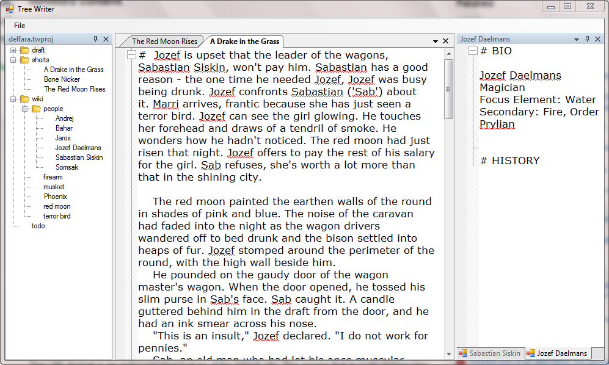

# TREE WRITER

The purpose of Tree Writer is to capture the way I structure the writing of a novel into one single application. A tree writer project is just a collection of text files. Ultimately, I like to do my actual writing in a bare-bones text editor. That's what you'll find here. There is no fancy formatting. It is just writing, all the time. But, there are some features that are amazingly useful.

* Folding. Create headings by proceeding the line with one or more #s. Now you can collapse large portions of the text so they are out of the way.
* Wikilinks. Surround any text in <square brackets> and it will become a wikilink. Absolutely invaluable for keeping track of your world and your research.
* Everything is stored as ordinary text files. Your data will never be trapped if something goes wrong. It's just text files.

Oh yeah - and all the windows are dockable so you can open multiple documents, or even look at multiple places in the same document, and arrange everything however you want.
